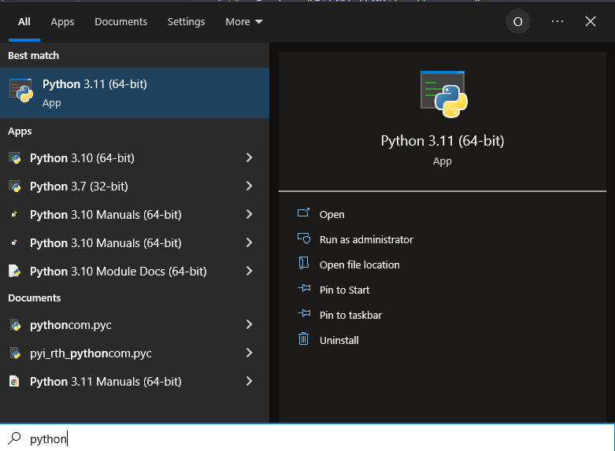

# 💥 JANI
JANI is a programming language dedicated to creating malware. It includes hundreds of built-in commands compatible with Windows, to exploit the victim whatever happens.


## ⏬ Installation
To download the repository, click the green `Code` button on the top:

and then `Download ZIP`:


It will download a zip archive, that you need to extract (later I'll attach an image here).

After that, you need to install Python, if you haven't already. Turn on PowerShell, and paste in the following content:
```powershell
$out = "${ENV:TEMP}\python.exe";
Invoke-WebRequest "python-link" -OutFile $out;
$out;
```

Then, if there are no errors, Python have succesfully installed on your computer. Enter the start menu and make sure you see Python:

*(You only need one version.)*

## 🧾 Syntax
The language mainly consists of things you can find in others.

**These are its types:**

Text (a.l.a. string) is a piece of text that you can do basically anything with.
```jani
cmd(line: "notepad")
```

**What are the notable differences?**

1. JANI doesn't have positional arguments. To specify an argument, you have to provide its name, then the value you want it to have.

2. Standard strings have Batch interpolation. To add an environment variable, you specify it like in Batch, e.g.: `"Welcome, %USERNAME%!"`

3. In JANI, you can run functions in the background, by using the call mode. It can be set in the current scope:
```jani
mode background;

# This is called in the background
download("...", "%USERPROFILE%\")

# This is called in the background, too
requestElevation()
```
or per each call:
```jani
# This is called in the background
background download("...", "%USERPROFILE%\")

# This is not
requestElevation()
```

4. JANI's standard library isn't too big; it's a pain for writing typical programs. It's adjusted for writing malware, like the whole point of JANI.

## 💥 Intellisense
###### too lazy

##### Please don't ask about the name. It's `JANI Aggresive NAT Intrusivity`. The J has no meaning like the whole name.
